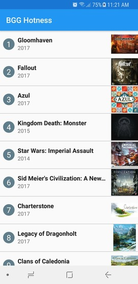
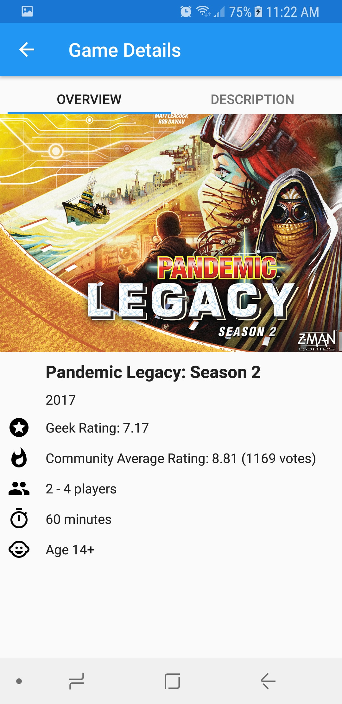
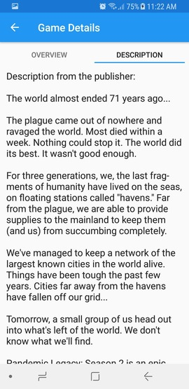

# BGG Hotness Android App

An Android App that displays the newest Hotness rank from BGG ([BoardGameGeek](https://boardgamegeek.com/)).

## Background

### About BGG
[BoardGameGeek](https://boardgamegeek.com/) is a website for board gaming enthusiasts around the world.  
The site hosts a board game database that contains detailed information for over 80,000 board games.  
It has a ranking system called "The Hotness", which lists the Top 50 board games that are being discussed by the members currently.

### About Me
My name is Saiyang Qi and I'm a pretty inexperienced programmer who graduated from Stony Brook University with a CS Master's Degree last year.  
Through my academic years, I never got a chance to learn Android. At some point after I graduated, I grew some interests in Android Programming, and since I knew Core Java well, I decided to give it a shot as a side hobby.  
I have been taking Android Basic classes from [Udacity](https://www.udacity.com/) on and off, and I have really enjoyed the content so far.  
My goal is to become a real Android Programmer one day.  

### About this App
In addtion to being a programmer, I'm also a huge board game fan.  
I discoverd the modern board gaming some time during my last year at school. Ever since, I have built a not so small game collection and I enjoy playing all of them.  
Just like many other board gamers around the globe, I visit [BoardGameGeek](https://boardgamegeek.com/) regularly, and I often use their "The Hotness" rank to discover new/popular games.  
Though, to be honest, their web design is abysmal in my opinion, and absolutely not mobile friendly.  
So ultimately, I decided to apply what I have learnt so far from [Udacity](https://www.udacity.com/) courses and build a simple app for both practicing and personal usage.  

## Walkthrough of the App as a User
### Screenshots
  

### Walkthrough
The first screenshot shows the home screen of the app. It displays "The Hotness" rank from [BoardGameGeek](https://boardgamegeek.com/) with some simple information such as the rank, the title, the year it was published, and a thumbnail of the game cover.  
The user can scroll down to view the rest of the list, and can click on any item to view its details. The second screenshot shows a details screen of a board game called "Pandemic Legacy: Season 2".  
The details screen has two tabs, screenshot 2 shows the default Overview Tab which lists information such as the rating, number of voters, the average gametime, and the suggested minimum player age.  
The user can then swipe right or click on the Description Tab to view the text description of the game, which usually gives the background story and some introduction, as shown in screenshot 3.  

## Key Takeaways
* **ConstraintLayout** - The courses were using LinearLayout most of the time, but I decided to use the new Android Studio default, and it's not hard at all (plus powerful).  
* **AsyncTaskLoader** - Fetch the data on the background thread to avoid UI being unresponsive.  
* **RecyclerView** - Recycle the individual item views using the adapter so the app is memory-efficient.  
* **TabLayout && ViewPager** - Use fragments to create swiping effect within a single activity.  
* **XmlPullParser** - Parse the needed info from the raw XML file. This part is tedious; I wonder if there is any better alternative.  
* [OkHttp](http://square.github.io/okhttp/) - A third-party library that makes http requests easy; in our case, fetching raw xml from the api only takes a few lines.  
* [Picasso](http://square.github.io/picasso/) - Another third-party library that takes care of image loading for us; super easy to use and very elegent.
